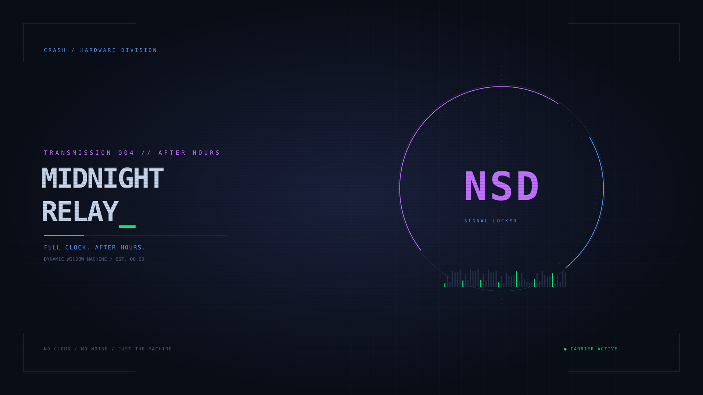
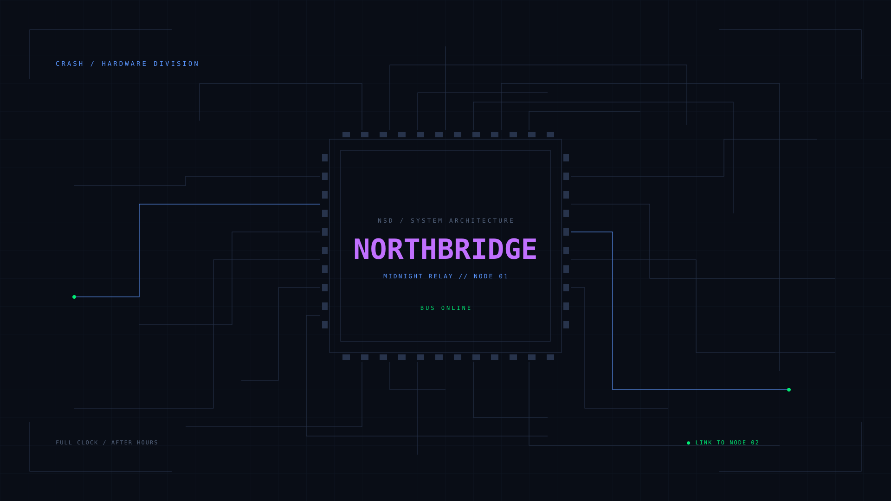

# NSD / MIDNIGHT RELAY — CRASH HARDWARE DIVISION

> Made for both Crash and future Cyberdeck environment 

> _and yes I know it is edgy as fuck_

**Full clock. After hours.** A retro-cyberpunk DWM desktop for the current workstation. Deep navy panels, violet selection blocks, electric blue labels, and a phosphor-green cursor. CRASH hardware branding, with NSD as the central insignia.



*The actual bundled wallpaper, not a desktop screenshot.* The editable [SVG](assets/midnight-relay.svg) and ready-to-use 1920×1080 PNG are included. `feh` crops it to fit each display.

## Palette

Only the three accent colors are borrowed from the supplied ZIP's theme. The desktop has its own identity and no integration with the source application. The archive remains untouched.

| Role | Color |
| --- | --- |
| Chassis / background | `#090D16` |
| Inactive border | `#27334B` |
| Readable terminal text | `#C6D3EA` |
| Blue typewriter / bar labels | `#5A96FF` |
| Violet selection / active border | `#C170FF` |
| Green cursor / signal | `#00EB74` |
| Amber alternate accent | `#FFB85C` |

DWM keeps the existing Fibonacci, extra-bar, and flycolors patches. The top bar holds numbered workspaces (`SYS`, `CODE`, `NET`, `WORK`, `AUX`), connection state, volume, and date/time. The bottom bar on the first monitor shows CPU utilization, AMD GPU load/temperature, and used RAM. Telemetry refreshes every two seconds without querying media players. The session cleans up its status process on exit.

`st` is the default terminal. An optional Kitty palette is also included: add `include midnight-relay.conf` to your existing Kitty config. The installer does not replace `kitty.conf`. Opaque windows keep text sharp; a compositor is optional future work.

## Current rig tuning

Read-only hardware inspection reported a **Ryzen 5 2600 (6 cores / 12 threads)**, approximately **16 GB RAM**, and an **AMD Ellesmere-family Radeon GPU**. PCI identification does not distinguish the exact card model. The live X display was inaccessible, so monitor modes and refresh rates remain unverified.

- Restored the original **120 updates/second** limit for dragging and resizing windows. This is DWM's mouse-event throttle, not a monitor refresh setting or a measured frame rate.
- Clean builds use up to **8 parallel jobs**, based on available logical CPUs, to reduce rebuild time while leaving headroom on this 12-thread machine.
- Hardware telemetry uses `/proc` and `/sys`; removed media polling and battery polling from the desktop status loop.
- Kept tiled resize hints disabled so terminal size increments do not leave unused strips between windows.
- Preserved the original dual-1080p monitor commands as an opt-in configuration until connectors can be verified.

No CPU governor, GPU driver, compositor, or system services are changed. Performance improvements have not been benchmarked; the changes above are the concrete tuning performed.

## Install on Arch Linux

From this repository, install build and X11 dependencies:

```sh
sudo pacman -S --needed base-devel pkgconf libx11 libxft libxinerama fontconfig \
  freetype2 ncurses xorg-server xorg-xinit xorg-xsetroot xorg-xprop \
  xorg-xrandr ttf-dejavu feh dunst libnotify maim i3lock xdg-user-dirs

./scripts/install.sh --check
./scripts/install.sh --install
```

The package names for [feh](https://archlinux.org/packages/extra/x86_64/feh/), [xsetroot](https://archlinux.org/packages/extra/x86_64/xorg-xsetroot/), and [DejaVu](https://archlinux.org/packages/extra/any/ttf-dejavu/) were checked against Arch's official package index. This setup expects an existing working Arch Linux / X11 desktop and audio stack.

Run the installer **as your normal user**. It compiles fresh copies in a temporary directory, ignoring the old binaries and object files already tracked in this repository. `--check` installs nothing. `--install` places binaries in `~/.local/bin`, installs user terminfo, copies the wallpaper and companion configs, and replaces `~/.xinitrc`. Existing destination files are saved in a unique `~/.dwmrice-backup.*` directory. `restore.tsv` maps numbered backups to their original paths; `created.txt` lists newly created ordinary files. Existing st terminfo files are also backed up; newly generated terminfo entries are not listed in `created.txt`.

Read and merge any custom commands from your backed-up `.xinitrc`, then log out of your current graphical session and run this from a TTY:

```sh
startx
```

The session adds `~/.local/bin` to PATH and uses Arch's system X initialization hooks. It does not force PulseAudio or alter your audio service. Nothing here has been installed into the development machine's real home directory.

## Controls

**Mod = Super / Wind*ws key.** The original Alt modifier is now available to applications.

| Keys | Action |
| --- | --- |
| Super + Shift + Enter | Open st |
| Super + P | RUN // application launcher |
| Super + 1–9 | Switch station |
| Super + Shift + 1–9 | Move window to station |
| Super + J / K | Focus next / previous window |
| Super + Enter | Promote focused window to master |
| Super + H / L | Resize master area |
| Super + T / F / M | Tile / float / monocle |
| Super + Shift + S / D | Fibonacci spiral / dwindle |
| Super + Shift + Space | Float focused window |
| Super + C / Shift + V | Next / previous accent color |
| Super + B | Toggle top bar |
| Super + Shift + B | Toggle bottom bar while on first monitor |
| Super + comma / period | Focus previous / next monitor |
| Super + Shift + X | Close focused window |
| Super + grave (backtick) | Show / hide scratchpad terminal |
| Super + minus / equals | Shrink / grow gaps by 2 px |
| Super + G | Toggle gaps |
| Super + Shift + E or Q | NSD session menu |
| Super + Ctrl + L | Lock screen |
| Print | Screenshot entire desktop |
| Shift + Print | Select screenshot region |
| Super + Print | Screenshot focused window |
| Shift + PageUp / PageDown (st) | Scroll terminal history |
| Shift + mouse wheel (st) | Scroll history three lines |

Firefox opens on workspace 3 (NET), which starts in monocle. Other workspaces start tiled.

## Display setup

The old `DisplayPort-0` / `HDMI-A-1` arrangement is saved as `~/.config/dwmrice/monitors.sh.example`. Copy it to `monitors.sh`, edit the connector names using `xrandr --query`, and make it executable to enable it. Install `xorg-xrandr` if needed. Otherwise the session uses the displays X11 detects. XDG config and data directory overrides are honored.

To change fonts, colors, tags, or bindings, edit the appropriate `suckless/*/config.h` and rerun the installer. Matching `config.def.h` files provide the same initial theme when a config is regenerated. To recreate the PNG after editing the SVG: `rsvg-convert assets/midnight-relay.svg -o assets/midnight-relay.png` (optional `librsvg` package).

## Window workflow

Gaps start at 10 px and can be adjusted from 0 to 40 px. Tile, spiral, and dwindle use them; monocle and fullscreen fill the available area. Each monitor remembers layout, master width/count, gap size, and gap visibility independently for every workspace. A multi-tag view has its own shared settings slot. Settings last for the DWM session.

The scratchpad is a floating st window, initially centered at three quarters of the monitor width. Its hotkey recalls it onto the current monitor/workspace, or hides it if already visible. It is excluded from swallowing.

**Terminal swallowing:** launch a new GUI process from st or Kitty and its window takes the terminal's position. Closing the GUI restores the terminal. This uses the window's `_NET_WM_PID` and Linux process ancestry; floating dialogs, terminals, scratchpads, and clients already fullscreen when mapped are excluded. Applications that delegate to an already-running process, remote X clients, or applications without a usable PID may not swallow. This is window organization, not process isolation.

**Scrollback:** st retains 2,000 lines, with keyboard and Shift-wheel navigation and text selection. Typing returns to live output. Full-screen alternate-screen applications do not enter shell history. Lines are not reflowed when the terminal width changes; narrowing truncates stored columns. Implementation derives from the [upstream st scrollback patch](https://st.suckless.org/patches/scrollback/); the exact base patch is retained in `patches/`, with local fixes for bounded history and alternate-screen isolation.

## Desktop tools

- **Notifications:** the session starts Dunst with `~/.config/dunst/nsd.conf` when Dunst is available and not already running. Normal messages use green on navy with violet borders; critical messages use amber. An existing notification daemon is not replaced. Test with `notify-send 'NSD // ONLINE' 'Hardware division reporting in.'`.
- **Telemetry:** The telemetry loop uses POSIX shell and awk. CPU is measured between samples; GPU readings come from AMD DRM/sysfs sensors. Volume uses an existing `wpctl` or `pactl` command with bounded timeouts; no audio server is installed or switched. Unavailable readings show `--`. The first short CPU sample settles into two-second intervals.
- **Screenshots:** `rice-shot screen`, `rice-shot region`, and `rice-shot window` save unique PNGs to your XDG Pictures directory under `Screenshots`. Escape cancels a region capture and removes the empty output file. Captures stay local; nothing is uploaded or automatically copied to the clipboard.
- **Session menu:** `rice-menu` offers lock, logout, reboot, and shutdown. The last three require a second confirmation. Logout asks this DWM instance to run its normal cleanup; reboot/shutdown use `systemctl` and your existing logind permissions.
- **Lock:** `rice-lock` runs the standard i3lock on a solid navy background. Authentication uses the system i3lock/PAM setup. It reports failure if i3lock is missing; automatic idle locking is not configured.
- **Dual-monitor art:** `rice-wallpaper` selects the schematic on Xinerama monitor 0 and the NSD emblem on monitor 1 when at least two active monitors are detected. A single display uses the emblem. Swap the image arguments in the script if Xinerama's ordering differs from your physical arrangement. Rerun it after a monitor hotplug.



Notification configuration follows the [Dunst manual](https://man.archlinux.org/man/dunst.5.en); screenshot modes use [maim](https://man.archlinux.org/man/maim.1.en), and locking uses [i3lock](https://man.archlinux.org/man/i3lock.1.en).

## Validation

```sh
./tests/smoke.sh
cc -D_XOPEN_SOURCE=600 -std=c99 -g -fsanitize=address,undefined \
  -o /tmp/nsd-scrollback-test tests/scrollback.c -lutil
ASAN_OPTIONS=detect_leaks=0 /tmp/nsd-scrollback-test
```

The shell smoke test checks script syntax, live telemetry output, clean builds, staged installation, and backups. The C scrollback test runs with address and undefined-behavior sanitizers. The scrollback checks cover selection, alternate-screen isolation, resizing, buffer wraparound, and reset.

Physical monitor behavior, lock authentication, screenshot capture, notifications, and audio-server integration still need verification in your desktop session.

## Apply from an existing session

Install the dependencies above and run `./scripts/install.sh --install`. Save your work, then log out and run `startx` from the TTY. The running DWM keeps its old bindings until restarted; the new build uses Super + Shift + E/Q for the confirmation menu. A graphical login manager needs a session command pointing to `~/.local/bin/rice-session`, since it may not read `.xinitrc`.
